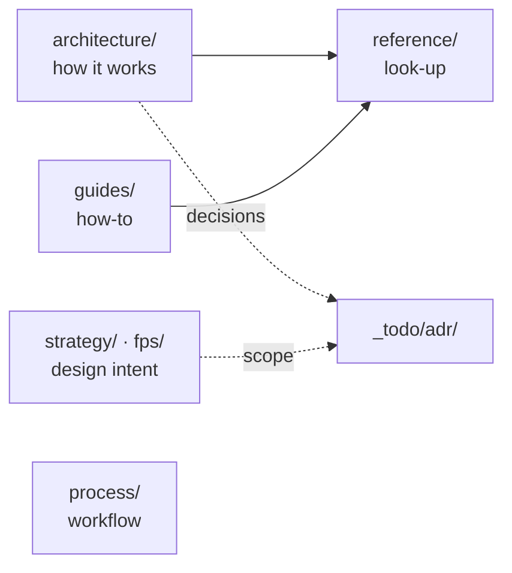

# Moho wiki

Engineering docs for the Moho workspace: a shared engine and two game lines
(strategy, FPS). Written for a developer who already knows the domain: terse, with
a diagram where one helps.

Planning (features, work items, ADRs, roadmap) lives in [`_todo/`](../_todo/README.md).
This wiki describes how the system **is**; `_todo/` describes what it **will be**.

## Map

## Start here

| I want to… | Read |
|---|---|
| See how the crates fit together | [architecture/overview](architecture/overview.md) |
| Follow one frame from input to pixels | [architecture/frame-loop](architecture/frame-loop.md) |
| Publish or handle an event | [architecture/events](architecture/events.md), then [best practices](reference/event-bus-best-practices.md) |
| Know where a key press goes | [architecture/input-and-state](architecture/input-and-state.md) |
| Understand chunk load, light, mesh, unload | [architecture/world-streaming](architecture/world-streaming.md) |
| Change rendering or a shader struct | [architecture/rendering](architecture/rendering.md), [reference/gpu-abi](reference/gpu-abi.md) |
| Add a debug-console command | [guides/adding-console-commands](guides/adding-console-commands.md) |
| Read or change a save file | [reference/save-format](reference/save-format.md) |
| Edit `config/prefs.ini` | [reference/prefs-format](reference/prefs-format.md) |
| Run the agentic workflow | [process/agentic-workflow](process/agentic-workflow.md) |
| Know what the games should become | [strategy/vision](strategy/vision.md), [fps/game-design-document](fps/game-design-document.md) |
| Know why a boundary exists | [ADRs](../_todo/adr/README.md) |

## Contents

**Architecture**

- [Overview](architecture/overview.md): crate graph, lines, dependency rules.
- [Frame loop](architecture/frame-loop.md): winit callbacks, per-frame order, redraw.
- [Events](architecture/events.md): bus modes, the channel hand-off, event families.
- [Input and state](architecture/input-and-state.md): dispatcher priorities, `GameState`.
- [World streaming](architecture/world-streaming.md): chunk lifecycle.
- [Rendering](architecture/rendering.md): render API boundary, pass order.
- [Console](architecture/console.md): debug console data flow.

**Reference**

- [GPU ABI](reference/gpu-abi.md): Rust ↔ WGSL struct layouts.
- [Prefs format](reference/prefs-format.md): `config/prefs.ini`.
- [Save format](reference/save-format.md): file envelope, world, scene and chunk files.
- [Console commands](reference/console-commands.md)
- [Event bus best practices](reference/event-bus-best-practices.md)
- [Event bus performance](reference/event-bus-performance.md): benchmarks.

**Crate READMEs** (API-level detail): [`moho_core`](../moho_core/README.md), [`moho_renderer`](../moho_renderer/README.md), [`moho_audio`](../moho_audio/README.md), [`moho_ui`](../moho_ui/README.md), [`moho_input`](../moho_input/README.md). API docs: `cargo doc --open --no-deps`.

**Guides, design, process**

- [Adding console commands](guides/adding-console-commands.md)
- [Strategy vision](strategy/vision.md) · [FPS design document](fps/game-design-document.md) (draft)
- [Agentic workflow](process/agentic-workflow.md)

## Known constraints

- Publishing an event from inside an event-bus handler deadlocks; hand off through a
  channel ([events](architecture/events.md#the-channel-hand-off)).
- `AudioSystem` is not `Send`/`Sync` and stays on the main thread.
- Event-bus history costs ~4.9× per publish when enabled; it is off by default.
- The UI takes input precedence: `InputDispatcher` stops at the first consumer
  ([input](architecture/input-and-state.md#input-routing)).

## Conventions

- **One page, one purpose.** Explanation in `architecture/`, look-up in `reference/`,
  task steps in `guides/`. Don't mix them.
- **Diagrams are Mermaid, in the page source.** GitHub renders them and they diff in
  review. No exported images.
- **Name the code, don't paste it.** Link a path and symbol; quote only what the source
  can't tell you (layouts, formats, invariants).
- **Rationale lives in an [ADR](../_todo/adr/README.md).** Link it; don't re-argue it here.
- **Each page has a `Source:` line** naming the code it describes, so drift is checkable.
  A page that no longer matches the code is a bug; fix it in the same PR.
- File names are `lower-kebab-case.md`.
