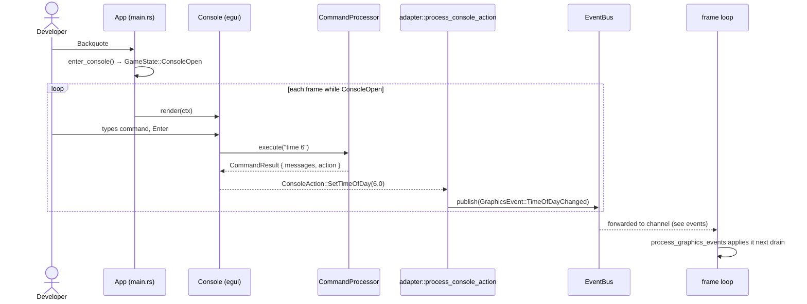

# Debug console

**Source:** `moho_ui/src/overlays/console/` (`mod.rs`, `commands.rs`),
`moho_ui/src/adapter/` (`rendering.rs`, `event_routing.rs`),
`src/app/event_loop/event_processor.rs` (`process_debug_events` and friends).

An egui overlay for developer commands. It is not modal by itself: `GameState::ConsoleOpen`
decides who gets input ([input-and-state](input-and-state.md)).

## Flow

Parsing is `CommandProcessor::execute` (a `match` on the first token). It returns text
for the console and a `ConsoleAction`. Side effects happen only by publishing events
from `process_console_action`; the console never touches `App`.

## Action → event

| `ConsoleAction` | Event published | Handled in |
|---|---|---|
| `Quit` | `UiEvent::ExitRequested` | `process_ui_events` (auto-saves, then exits) |
| `Close` | `UiEvent::MenuHidden { "console" }` | `process_ui_events` |
| `ToggleGodMode` | `DebugEvent::ToggleGodMode { enabled: true }` | `process_debug_events` (logs only; not implemented) |
| `ToggleNoclip` | `DebugEvent::ToggleCollision { enabled: false }` | sets `physics.world.noclip` |
| `SetSunDirection(yaw, pitch)` | `GraphicsEvent::SunDirectionChanged` (radians) | `process_graphics_events` |
| `SetTimeOfDay(h)` | `GraphicsEvent::TimeOfDayChanged` | `process_graphics_events` |
| `SetDebugView(m)` | `GraphicsEvent::DebugViewChanged` | `process_graphics_events` |
| `SetShadowQuality(q)` | `DebugEvent::SetShadowQuality` | `process_debug_events` |
| `SetSsaoQuality(q)` | `DebugEvent::SetSsaoQuality` | `process_debug_events` |
| `Spawn(type, args)` | `DebugEvent::SpawnEntity { position: None }` | raycasts from the camera for a position |

Command syntax: [console commands](../reference/console-commands.md). To add one:
[guide](../guides/adding-console-commands.md).

## Caveats

- `ToggleGodMode` and `ToggleNoclip` publish fixed values (`true` / `false`), not a toggle.
  The noclip handler sets `noclip = !enabled`, so `noclip` always turns it **on**; the
  console cannot turn it off.
- God mode has no implementation behind the event.
