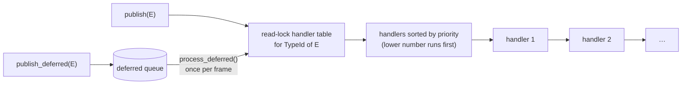
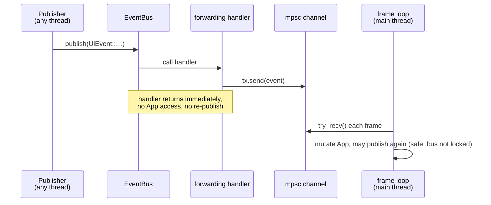

# Events

**Source:** `moho_core/src/events/` (`bus.rs`, `types/`), `src/app/event_setup.rs`.
**Related:** [ADR-0003](../../_todo/adr/0003-core-owns-event-types.md) (core owns event types; narrowed by [ADR-0010](../../_todo/adr/0010-world-geometry-is-a-mesh-contract.md)),
[best practices](../reference/event-bus-best-practices.md), [benchmarks](../reference/event-bus-performance.md).

Use the bus for fan-out across systems. Inside one system, call directly.

## Bus model

`EventBus` is a typed pub/sub keyed by `TypeId`, shared as `Arc<EventBus>`.
It is passed to whoever needs it; there is no global.

| API | Semantics |
|---|---|
| `subscribe(f)` / `subscribe_with_priority(f, p)` | Handler runs synchronously on the publisher's thread. Priority: **lower runs first** (default 0). |
| `publish(e)` | Dispatch now. Holds the table read-lock, so a handler must not publish (deadlock). |
| `publish_deferred(e)` + `process_deferred()` | Queue now, dispatch when drained. |
| `with_history(true, n)` | Records `Debug` strings. ~4.9× per-publish cost; off by default. |

`InputDispatcher` uses the **opposite** priority convention (higher first). See
[input](input-and-state.md#input-routing).

## The channel hand-off

Handlers can't mutate `App` (they are `Fn + Send + Sync`) and can't publish. The
binary solves both with one `std::sync::mpsc` channel per event family. `setup_event_bus`
(`event_setup.rs`) subscribes a forwarding closure per family, and the frame loop
drains the receivers on the main thread.

Cascading effects (event A causes event B) therefore resolve on a later drain, never
inside a handler. Drain order is fixed: [frame-loop](frame-loop.md#event-drain).

## Event families

Engine families live in `moho_core::events` (`types/`); `WorldEvent` lives in `moho_voxel`. Variant lists: `cargo doc -p moho_core`.

| Family | Typical producers | Drained by |
|---|---|---|
| `SystemEvent` | frame loop (`FrameStart`/`FrameEnd`), lifecycle | subscribers on demand |
| `UiEvent` | menus, settings, console | `process_ui_events` |
| `AudioEvent` | game, UI | `process_audio_events` |
| `InputEvent` | input layer | not drained by the loop (see note) |
| `GraphicsEvent` | console, settings, game clock | `process_graphics_events` |
| `WorldEvent` (defined in `moho_voxel`) | streaming, light system, block edits | `process_world_events` |
| `DebugEvent` | console | `process_debug_events` |

Note: `process_input_events` does not drain the bus. It drains the binary's own
`input_event::InputEvent` channel, fed by low-priority `InputDispatcher` handlers
(mouse wheel, mine click) when the UI did not consume the event.

Payload rules: small, past-tense, immutable, enough data that a consumer doesn't
re-fetch. Prefer `&'static str` or ids over `String` on hot events.

## Rules of thumb

- Don't publish from a handler. Forward to a channel or use `publish_deferred`.
- Don't capture non-`Send` state (`AudioSystem`); hand off to the main thread.
- Leave history off outside debugging.
- A new engine-wide event type (audio, input, lifecycle) goes in `moho_core::events`. A
  line-specific one goes in that line's crate (ADR-0003, narrowed by ADR-0010).
