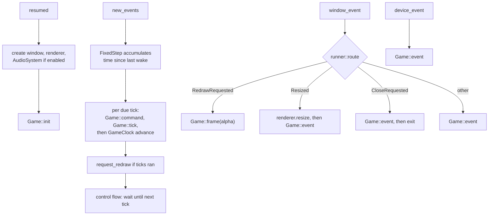
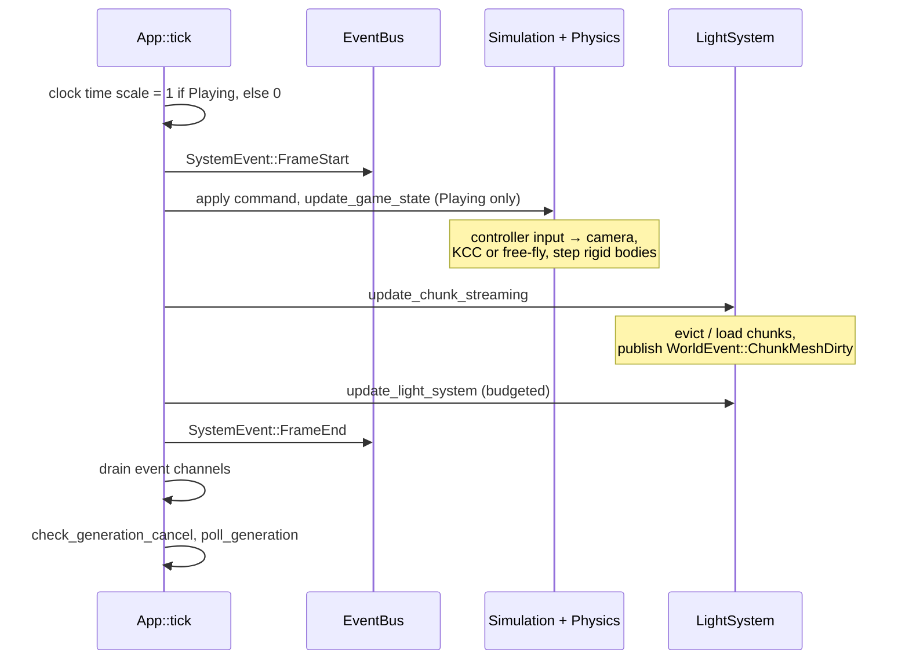

# Frame loop

**Source:** `moho_app/src/` (`runner.rs`, `lib.rs`, `headless.rs`, `fixed_step.rs`, `clock.rs`), `src/app/game.rs`
(`impl moho_app::Game for App`), `src/app/event_loop/`.
**Related:** [ADR-0009](../../_todo/adr/0009-simulation-time-is-one-fixed-tick.md) (fixed tick).

`moho_app::run` owns the window, the winit `ApplicationHandler` (`runner.rs`) and the
renderer and audio handles. A game implements the `Game` trait; the binary's `App`
implements it in `src/app/game.rs`. Simulation runs in fixed ticks from `new_events`,
window and device input go to `Game::event`, drawing is `Game::frame` on `RedrawRequested`.

## Callbacks

A game stops the loop with `request_exit` on its `FrameContext` or `EventContext`.
Init failures (window, renderer) end `run` with an `AppError`; audio failure only logs.
`FrameContext::renderer` and `audio` are `None` under `HeadlessLoop`, which drives the
same `command`/`tick`/`frame` without a window (`init` and `event` never run).
Time beyond `max_catch_up_ticks` is dropped ([overview](overview.md#fixed-step-loop-moho_app)).

## `Game::tick` order (`App`)

`tick` receives the `StrategyCommand` sampled by `command()` (movement, jump and look from the
tick's `ActionFrame`; default outside `GameState::Playing`). Steps, in order:

Scene load and the console `time` command reset the clock (`reset_to`) while the events
drain. The loop advances the clock after `tick` returns, so a reset made in a Playing tick
gets that tick's advance on top.

All gameplay steps early-return unless `GameState::Playing`. `dt` is the fixed tick length.

## Event drain

The tick drains one channel per event family, in this order:

| # | Drain | Effect |
|---|---|---|
| 1 | `process_ui_events` | load/new world, exit request (auto-save runs in `frame`), menus |
| 2 | `process_graphics_events` | time of day, debug view |
| 3 | `process_world_events` | `ChunkMeshDirty` → remesh (draw + collider) |
| 4 | `process_input_events` | wheel zoom, mine action |
| 5 | `process_debug_events` | spawn, god mode, noclip; point lights and shadow/SSAO quality are queued as `RenderRequest`s |

Audio events are drained in `Game::frame` and forwarded to `AudioSystem`, since the runner
owns it. Why channels instead of handling inside bus handlers: [events](events.md#the-channel-hand-off).

## Frame

The renderer is reachable only through the contexts, so ticks queue renderer changes
(`RenderRequest`: point lights, shadow and SSAO quality) and `Game::frame` applies them.
`App::frame`, in order:

1. `poll_gamepads`: apply pad events while playing with focus, otherwise discard them
   and release pad actions;
2. apply queued `RenderRequest`s and drain audio events;
3. if the UI asked to quit: auto-save, `request_exit`, stop;
4. `update_hud_data`, then `update_lighting` (sun, moon, ambient) and `scene.render(...)`
   with actors, the sphere and cube mesh handles and the camera;
5. recall the egui staging belt.

A `FrameError` skips the frame with a `warn`. Pass order inside the renderer:
[rendering](rendering.md#pass-order). `alpha` (tick interpolation) is not used yet.
