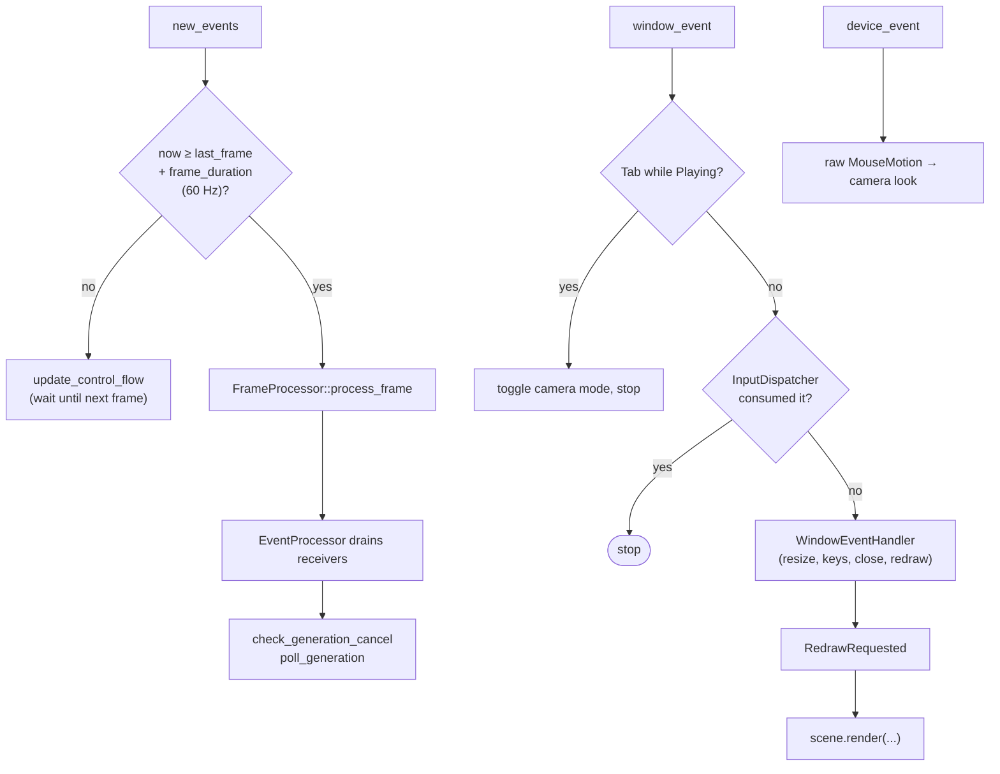
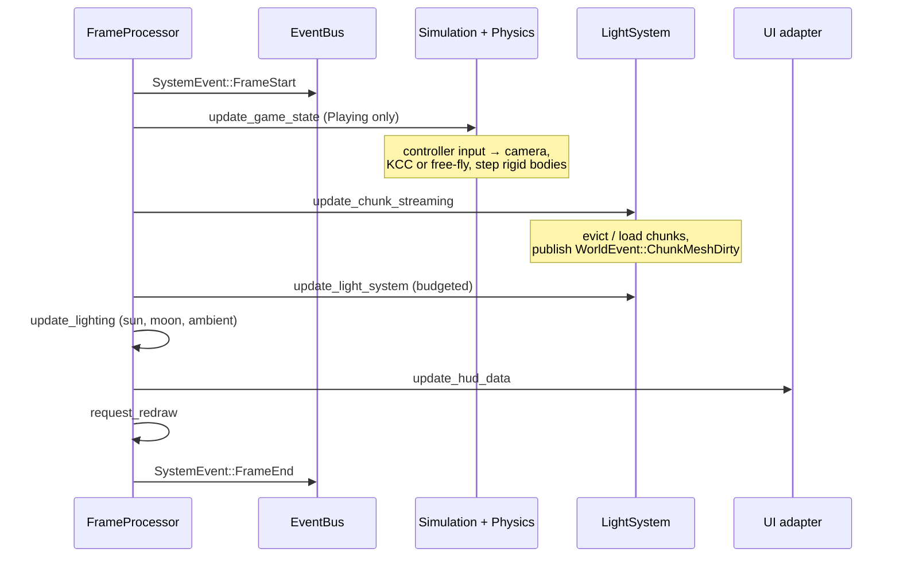

# Frame loop

**Source:** `src/main.rs` (`ApplicationHandler for App`), `src/app/event_loop/`.
**Related:** [ADR-0009](../../_todo/adr/0009-simulation-time-is-one-fixed-tick.md) (fixed tick; the loop does not implement it yet).

The binary is a `winit` `ApplicationHandler`. Simulation work runs in `new_events`,
window input in `window_event`, drawing in the `RedrawRequested` window event.

## Callbacks

## `process_frame` order

`FrameProcessor::process_frame` advances `last_frame` by one `frame_duration`, then:

All gameplay steps early-return unless `GameState::Playing`.

## Event drain

After `process_frame`, `new_events` drains one channel per event family, in this order:

| # | Drain | Effect |
|---|---|---|
| 1 | `process_ui_events` | load/new world, exit (auto-save), menus |
| 2 | `process_audio_events` | forward to `AudioSystem` |
| 3 | `process_graphics_events` | time of day, quality settings |
| 4 | `process_world_events` | `ChunkMeshDirty` → remesh + collider |
| 5 | `process_input_events` | wheel zoom, mine action |
| 6 | `process_debug_events` | spawn, god mode, noclip |

Why channels instead of handling inside bus handlers: [events](events.md#the-channel-hand-off).

## Redraw

`handle_redraw_requested` calls `scene.render(...)` with actors, chunk meshes, the
camera, and material indices, then recalls the egui staging belt. A
`FrameError` skips the frame with a `warn`. Pass order inside the renderer:
[rendering](rendering.md#pass-order).

## Known gaps

- `dt` is the constant `frame_duration`, so each simulation step is tied to one rendered
  frame with no catch-up cap. [ADR-0009](../../_todo/adr/0009-simulation-time-is-one-fixed-tick.md)
  replaces this with an accumulator and fixed ticks (ENG-F6).
