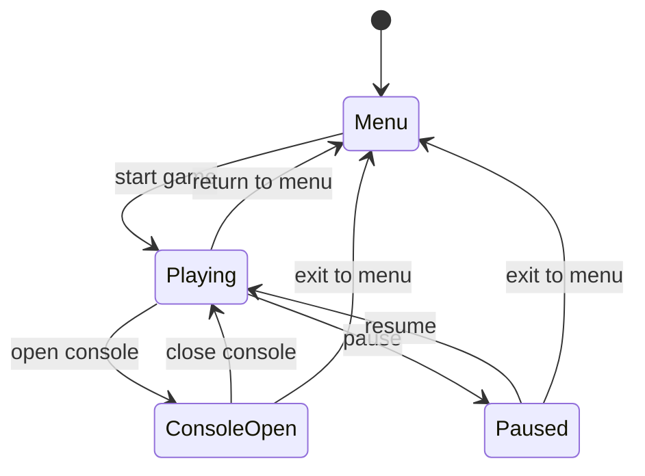

# Input and state

**Source:** `src/input_dispatcher.rs`, `src/app/renderer_setup.rs` (registrations),
`src/main.rs` (`window_event`, `handle_keyboard_input`), `moho_ui/src/app_state/game_state.rs`,
`moho_ui/src/app_state/state_coordinator.rs`.

## Input routing

Every `WindowEvent` goes through `window_event` in this order. The first stage that
consumes the event ends the path.

`InputDispatcher` is a sorted `Vec<(priority, handler)>`. **Higher number runs first.**
This is the opposite of `EventBus::subscribe_with_priority` (lower first); the two are
independent.

Two properties that bite:

- Each input kind gets its own `register` call (wheel and mine-click are separate
  handlers), so a new input type is a new registration, not a new branch.
- A forwarder drops the event rather than blocking if it can't take the UI adapter lock.

Global hotkeys in `handle_keyboard_input`, checked before game keys:

| Key | Effect |
|---|---|
| `` ` `` (Backquote) | Playing → console; ConsoleOpen → Playing |
| `Esc` | ConsoleOpen → Playing; Playing → pause menu |
| `F3` | Toggle debug HUD |
| `F4` | Toggle chunk-boundary minimap |
| `Tab` | Toggle camera mode (handled before the dispatcher) |

Key → binding-code mapping is in `moho_input`; bindings come from
[prefs](../reference/prefs-format.md).

## GameState

`moho_ui::GameState` decides input routing, rendering, cursor and whether the
simulation runs. `can_transition_to` is the legality table; `StateTransitionCoordinator`
returns the side effects (UI visibility, cursor grab) for a legal transition.

Same-state transitions are allowed (no-op). Everything else is rejected, including
`Menu → ConsoleOpen` and `ConsoleOpen ↔ Paused`.

| State | Input goes to | Draws | Cursor | Simulation |
|---|---|---|---|---|
| `Menu` | menu | menu screens | free | stopped |
| `Playing` | game | world | grabbed | running |
| `ConsoleOpen` | console text | world (frozen) + console | free | paused |
| `Paused` | pause menu | world (frozen) + menu | free | paused |

`src/game_state.rs` re-exports it; the app maps it to `moho_ui::GameState` for the UI adapter. Per-frame gameplay steps check `== Playing` ([frame-loop](frame-loop.md)).
