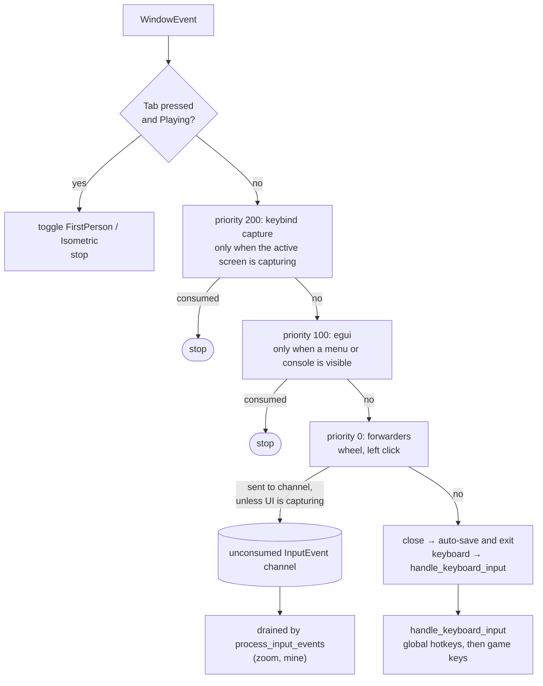
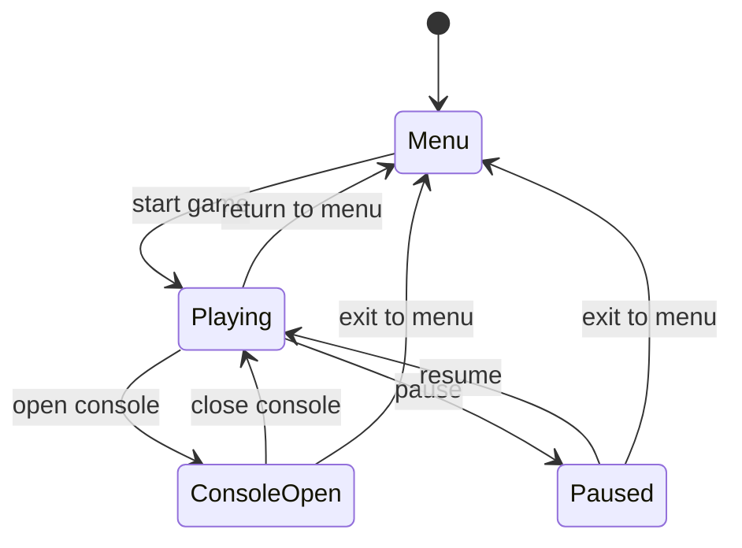

# Input and state

**Source:** `src/input_dispatcher.rs`, `moho_input/src/`, `moho_ui/src/actions.rs`, `src/app/renderer_setup.rs` (registrations),
`src/app/game.rs` (`Game::event`, `poll_gamepads`), `src/main.rs` (`handle_keyboard_input`), `moho_ui/src/app_state/game_state.rs`,
`moho_ui/src/app_state/state_coordinator.rs`.

## Input routing

Every `WindowEvent` the runner forwards reaches `Game::event` (`App::handle_window_event`) and goes through this order. The first stage that
consumes the event ends the path.

`InputDispatcher` is a sorted `Vec<(priority, handler)>`. **Higher number runs first.**
This is the opposite of `EventBus::subscribe_with_priority` (lower first); the two are
independent.

Two properties that bite:

- Each input kind gets its own `register` call (wheel and mine-click are separate
  handlers), so a new input type is a new registration, not a new branch.
- A forwarder drops the event rather than blocking if it can't take the UI adapter lock.

Global hotkeys in `handle_keyboard_input`, checked before game keys:

| Key | Effect |
|---|---|
| `` ` `` (Backquote) | Playing → console; ConsoleOpen → Playing |
| `Esc` | ConsoleOpen → Playing; Playing → pause menu |
| `F3` | Toggle debug HUD |
| `F4` | Toggle chunk-boundary minimap |
| `Tab` | Toggle camera mode (handled before the dispatcher) |

Gameplay input is action-keyed. `moho_input` holds the platform-free `Key` and
`MouseButton` (`Key::from_winit` maps `PhysicalKey`), the `Action` trait (stable id plus
default bindings), `ActionBindings<A>`, and `ActionMap<A>`
(`moho_input/src/action_map.rs`). Each game declares its own action enum
(`StrategyAction` in `moho_ui/src/actions.rs`); the binary owns one `ActionMap` in
`InputState` (`src/app/input_state.rs`).

`handle_window_event` and `handle_device_event` feed key, mouse-button and raw
mouse-motion events into the map. Gamepads feed it too: `Gamepads::poll`
(`moho_input/src/gamepad.rs`, the only module that names `gilrs`) drains backend events
into `pad_button` / `pad_axis` once per frame from `App::poll_gamepads`
(`InputState::gamepads`, `None` when the backend fails to start). Outside `Playing`, or
while the window lacks focus (`InputState::focused`), the events are discarded unapplied
and `pad_disconnected` releases pad bindings. Every menu and console transition (`App::apply_transition`,
`src/main.rs`) also calls `ActionMap::release_all`, so nothing stays held across a menu or the
console and no press made there lands on resume; a key still down on resume acts only after it
is pressed again. Once per tick `App::command` (`src/app/game.rs`) calls `end_tick`,
which returns an `ActionFrame` and resets the per-tick state:

- `held`: down at the end of the tick; `pressed` / `released`: edges at any point in the
  tick, so a tap shorter than a tick is not lost.
- `look`: the right stick adds `PAD_LOOK_PER_TICK` times its deflection per tick (after a
  small dead zone), on top of the mouse input below. The mouse part is the tick's accumulated mouse motion scaled by sensitivity, then, when
  filtering is on, deadzone, exponential smoothing and the linear response curve
  (`moho_input/src/filter.rs`). Motion is unnegated; `App::command` inverts it for
  yaw and pitch.

A stick direction binding is down while its axis is at or past `STICK_DIRECTION_THRESHOLD`.
An action is held when any of its bindings is down. A frame holds at most 64 actions.
Bindings persist in the `[bindings]` section of [prefs](../reference/prefs-format.md).

## GameState

`moho_ui::GameState` decides input routing, rendering, cursor and whether the
simulation runs. `can_transition_to` is the legality table; `StateTransitionCoordinator`
returns the side effects (UI visibility, cursor grab) for a legal transition.

Same-state transitions are allowed (no-op). Everything else is rejected, including
`Menu → ConsoleOpen` and `ConsoleOpen ↔ Paused`.

| State | Input goes to | Draws | Cursor | Simulation |
|---|---|---|---|---|
| `Menu` | menu | menu screens | free | stopped |
| `Playing` | game | world | grabbed | running |
| `ConsoleOpen` | console text | world (frozen) + console | free | paused |
| `Paused` | pause menu | world (frozen) + menu | free | paused |

`src/game_state.rs` re-exports `moho_ui::GameState`; the UI adapter takes the same type. Per-frame gameplay steps check `== Playing` ([frame-loop](frame-loop.md)).
