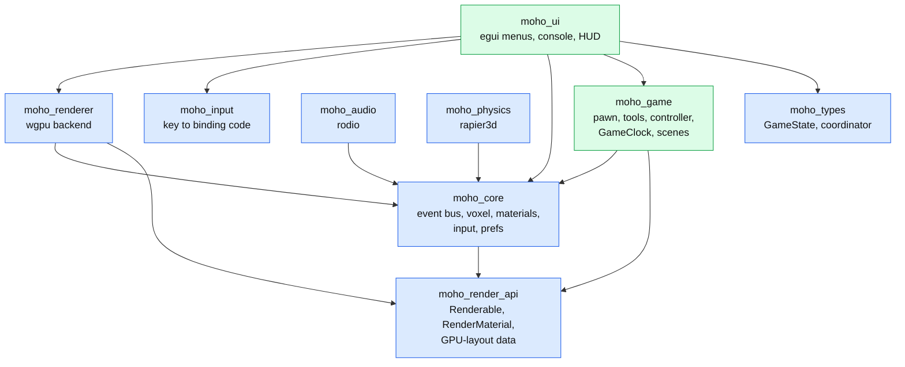
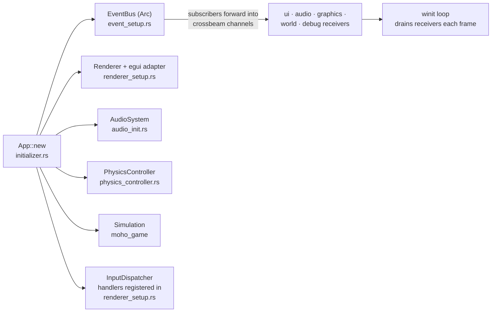

# Architecture overview

**Source:** crate `Cargo.toml`s, `scripts/layering.txt`, `src/app/`.
**Decisions:** ADRs
[0001](../../_todo/adr/0001-render-api-boundary.md),
[0002](../../_todo/adr/0002-voxel-and-materials-stay-in-core.md),
[0003](../../_todo/adr/0003-core-owns-event-types.md),
[0004](../../_todo/adr/0004-entity-storage-without-a-general-ecs.md),
[0005](../../_todo/adr/0005-crate-lines-and-dependency-direction.md).

## Crate graph

Arrows run from dependent to dependency; colour is the line from `scripts/layering.txt`.
The `moho` binary depends on all of them and is omitted from the edges.

Blue is the engine line, green is the strategy line. The FPS line has no crates yet.

## Lines and rules

Each crate belongs to exactly one line ([ADR-0005](../../_todo/adr/0005-crate-lines-and-dependency-direction.md)).
`just check` enforces these over normal and build edges:

| Rule | Reason |
|---|---|
| Engine crates never depend on a game-line crate (dev-dependencies allowed) | The engine ships to both games and, after the split, from its own repo |
| A game line never depends on another game line | Strategy and FPS must separate cleanly |
| Domain crates (`moho_core`, `moho_game`) never reach `winit`, `wgpu` or `egui` | Domain logic runs headless |

Known debt: `voxel/` and `MaterialType` sit in the engine line
([ADR-0002](../../_todo/adr/0002-voxel-and-materials-stay-in-core.md)). Their final
placement is decided as part of the repo split.

## Runtime composition

`App::new` (`src/app/initializer.rs`) builds each subsystem and passes dependencies
explicitly. There is no service locator.

## Where state lives

| State | Owner |
|---|---|
| Voxel grid, light | `moho_core::voxel::LightSystem` (owns the grid) |
| Chunk meshes | `ChunkStore` in `moho_core` |
| Actors (spheres, cubes) | `ActorStore` in `moho_game` |
| Time of day | `moho_game::GameClock`, advanced by the simulation step |
| App mode | `moho_types::GameState` ([input-and-state](input-and-state.md#gamestate)) |
| GPU resources | `moho_renderer`; game types reach it only through `moho_render_api` ([rendering](rendering.md)) |
| Prefs | `moho_core::prefs::Prefs` ([format](../reference/prefs-format.md)) |

Entities live in typed stores; there is no general ECS (ADR-0004).

## Next

[Frame loop](frame-loop.md) · [Events](events.md) · [Rendering](rendering.md)
