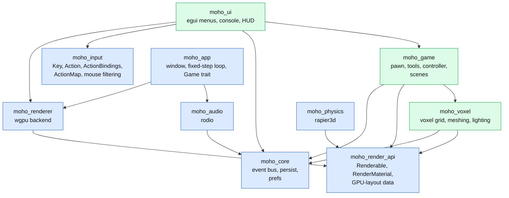
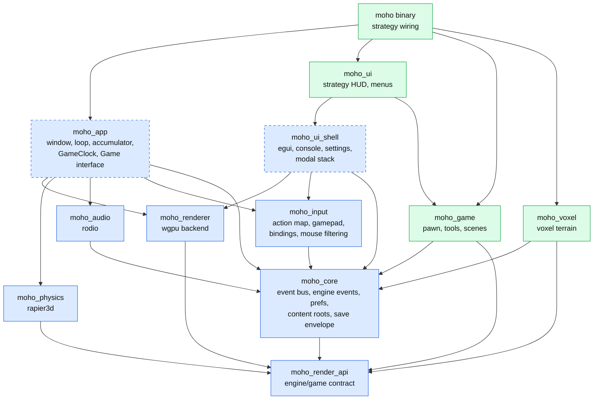
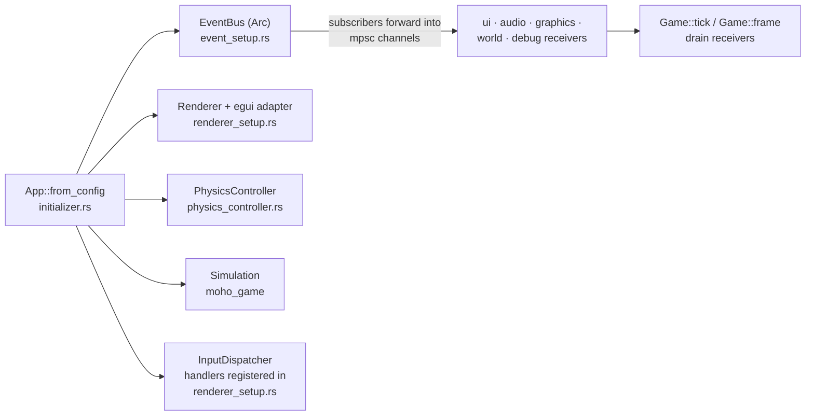

# Architecture overview

**Source:** crate `Cargo.toml`s, `scripts/layering.txt`, `moho_app/src/`, `src/app/`, `src/main.rs`.
**Decisions:** ADRs
[0001](../../_todo/adr/0001-render-api-boundary.md),
[0003](../../_todo/adr/0003-core-owns-event-types.md),
[0004](../../_todo/adr/0004-entity-storage-without-a-general-ecs.md),
[0005](../../_todo/adr/0005-crate-lines-and-dependency-direction.md),
[0010](../../_todo/adr/0010-world-geometry-is-a-mesh-contract.md),
[0012](../../_todo/adr/0012-engine-crate-map-for-m2.md).

## Crate graph

Arrows run from dependent to dependency; colour is the line from `scripts/layering.txt`.
The `moho` binary depends on all of them and is omitted from the edges.

Blue is the engine line, green is the strategy line. The FPS line has no crates yet.
`moho_app` owns the window and winit event loop; the binary implements its `Game` trait and hands it
to `moho_app::run` ([frame loop](frame-loop.md)).

## Lines and rules

Each crate belongs to exactly one line ([ADR-0005](../../_todo/adr/0005-crate-lines-and-dependency-direction.md)).
`just check` enforces these over normal and build edges:

| Rule | Reason |
|---|---|
| Engine crates never depend on a game-line crate (dev-dependencies allowed) | The engine ships to both games and, after the split, from its own repo |
| A game line never depends on another game line | Strategy and FPS must separate cleanly |
| Domain crates (`moho_core`, `moho_voxel`, `moho_game`) never reach `winit`, `wgpu` or `egui` | Domain logic runs headless |

Voxels live in the strategy-line `moho_voxel` ([ADR-0010](../../_todo/adr/0010-world-geometry-is-a-mesh-contract.md));
the engine sees world geometry only as meshes.

## Target crate graph (M2)

Where the M1–M2 engine work lands, from [ADR-0012](../../_todo/adr/0012-engine-crate-map-for-m2.md)
(Proposed). Capabilities land as modules of an existing crate first; a new crate needs a
deployable, reuse or compile-time boundary. Dashed boxes are crates that don't exist yet, or (`moho_app`) exist with only part of the listed scope: today the window and event loop, accumulator, `GameClock` and `Game` trait.
Edges are the intended direction, not a list each crate must have.

Changes from today:

- Scene import (ENG-F14), navigation (ENG-F17) and the character controller and camera
  (ENG-F21) are modules of an engine crate unless their specs name a boundary.

An FPS line would sit beside the strategy line and depend only on engine crates.

### Engine seams

The public APIs the [ENG-F5](https://github.com/WrackedFella/moho/issues/232)
gate holds fixed: game plug-in interface, world-geometry contract, action map, physics
queries, spatial audio, content roots, save envelope, scene import. Adding or changing
one is an ADR-level change.

## Fixed-step loop (`moho_app`)

Window-free scheduling for any game line ([ADR-0009](../../_todo/adr/0009-simulation-time-is-one-fixed-tick.md)).

| Item | Role |
|---|---|
| `Game` trait (`lib.rs`) | `command()` sampled once per tick, `tick()` applies it, `frame()` presents with an interpolation `alpha`; optional `init()` (window and renderer exist) and `event()` (winit window/device events) |
| `run`, `AppConfig` (`runner.rs`) | Creates the window, renderer and optional `AudioSystem`, drives the `Game` from the winit loop; `AppError` on startup failure |
| `InitContext` / `EventContext` / `FrameContext` (`lib.rs`) | What a game may touch: window, renderer, audio, `request_exit`, and a read-only `clock()` (`EventContext`, `FrameContext`). Renderer and audio are `Option` (absent headless) |
| `GameClock` (`clock.rs`) | Time of day, day/night lengths, time scale and sun/moon directions. Seeded from `LoopConfig::clock`, owned by the loop (`run` and `HeadlessLoop`); `TickContext::clock` is `&mut` for the tick, and the loop advances it by one tick length times its time scale after `Game::tick` returns |
| `LoopConfig` / `FixedStep` (`fixed_step.rs`) | Integer accumulator (`nanoseconds * tick_hz`), so no drift; returns whole ticks due per frame |
| `HeadlessLoop` (`headless.rs`) | Drives a `Game` without a window: `advance(game, frame_dt)` runs due ticks then one frame; `step(game, n)` runs ticks only |

Invariants: ticks per frame are capped by `max_catch_up_ticks` (default 5) and time beyond the cap is
dropped except the sub-tick remainder; `tick_hz` must be non-zero (`FixedStep::new` panics); `TickContext::tick` counts from 0.

## Runtime composition

`App::from_config` (`src/app/initializer.rs`) builds each subsystem and passes dependencies
explicitly. There is no service locator. The window, renderer and `AudioSystem` are created by
`moho_app::run` and passed to the game through its contexts.

## Where state lives

| State | Owner |
|---|---|
| Voxel grid, light | `moho_voxel::LightSystem` (owns the grid) |
| Chunk meshes | `ChunkStore` in `moho_voxel`; the renderer holds its own copy as `WorldMeshes` ([rendering](rendering.md#world-geometry)) |
| Actors (spheres, cubes) | `ActorStore` in `moho_game` |
| Time of day | `moho_app::GameClock`, owned by the loop and advanced after each `Game::tick` |
| App mode | `moho_ui::GameState` ([input-and-state](input-and-state.md#gamestate)) |
| GPU resources | `moho_renderer`; game types reach it only through `moho_render_api` ([rendering](rendering.md)) |
| Prefs | `moho_core::prefs::Prefs` ([format](../reference/prefs-format.md)) |

Entities live in typed stores; there is no general ECS (ADR-0004).

## Logging

All crates emit `tracing` events (`tracing::info!(count = n, "message")`, structured
fields over interpolated text); the `log` facade is not a workspace dependency.
`init_logging` in `src/main.rs` installs the only subscriber, filtered by `RUST_LOG`
(default `info`), and also receives `log` records from third-party dependencies.
Library crates never install a subscriber.

## Next

[Frame loop](frame-loop.md) · [Events](events.md) · [Rendering](rendering.md)
