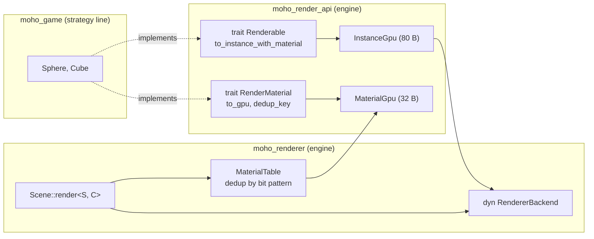
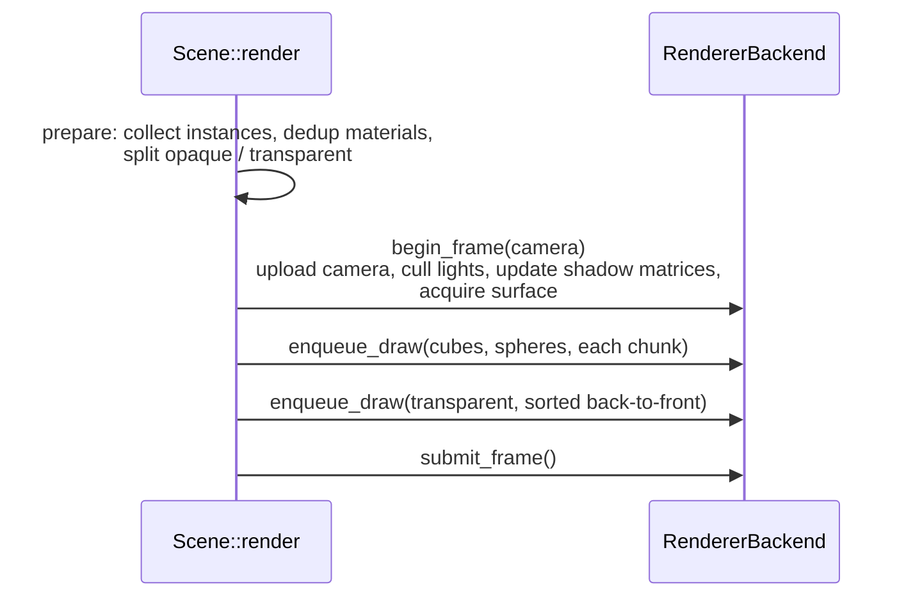
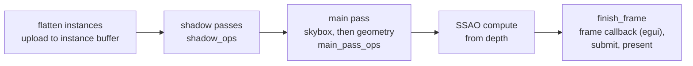

# Rendering

**Source:** `moho_render_api/src/`, `moho_renderer/src/` (`scene.rs`, `renderer.rs`,
`render_ops/`, `shadow.rs`, `ssao.rs`), `shaders/`.
**Decision:** [ADR-0001](../../_todo/adr/0001-render-api-boundary.md).

## Boundary

The renderer never names a game type. Game types implement `Renderable` and
`RenderMaterial` from `moho_render_api`, and the renderer only sees `InstanceGpu` and
`MaterialGpu`.

`Scene::render` is generic over the actor types, so `moho_renderer` compiles without
`moho_game`. Voxel chunks (`VoxelChunk`) are the exception for now: the renderer
takes them from `moho_core`. [ADR-0010](../../_todo/adr/0010-world-geometry-is-a-mesh-contract.md)
replaces this with a mesh contract (add, replace, remove by handle).

## Submission

`Scene::render` (called from the redraw handler) does CPU-side collection, then calls
the backend in a fixed sequence:

`begin_frame` returns `FrameError` if the surface can't be acquired; the frame is
skipped with a warning.

## Pass order

`submit_frame` flattens all pending draws into one instance buffer, then records one
command encoder:

The egui UI is drawn by the `FrameCallback` the UI adapter registers on the renderer,
inside `finish_frame`. Shader sources are `shaders/*.wgsl` (`common`, `vertex`,
`fragment`, `shadow`, `skybox`, `gtao`, `ssao_blur`, `pcss`, `instance`).

## Tunables

| Setting | Where | Notes |
|---|---|---|
| Shadow quality 0–4 | `graphics.shadow_quality`, `r_shadow_quality` | Off/Low/Med/High/Ultra |
| SSAO quality 0–4 | `graphics.ssao_quality`, `r_ssao_quality` | Samples 0/4/8/16/32 |
| Debug view | `r_debug_view <mode>` | `Lighting.params.y` |
| Shadow map size | `SHADOW_MAP_SIZE` = 4096 | `shadow.rs` |
| Shadow distance | `SHADOW_DISTANCE` = 1000 | `shadow.rs` |

CPU↔GPU struct layouts: [GPU ABI](../reference/gpu-abi.md).
