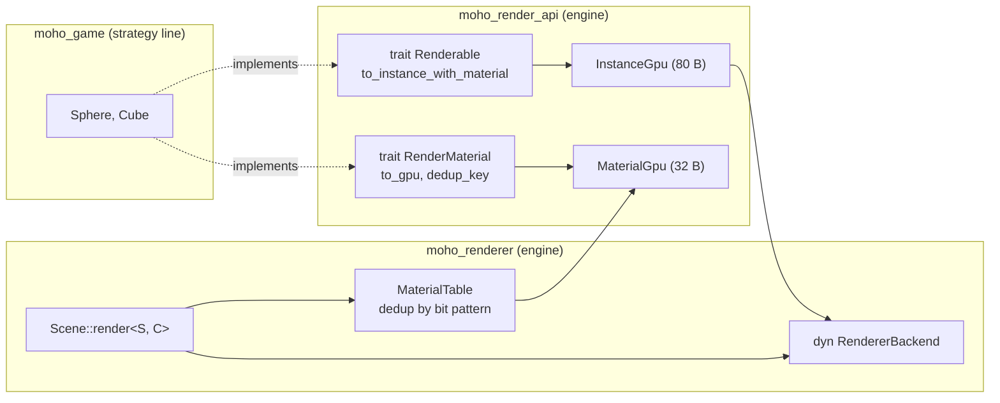
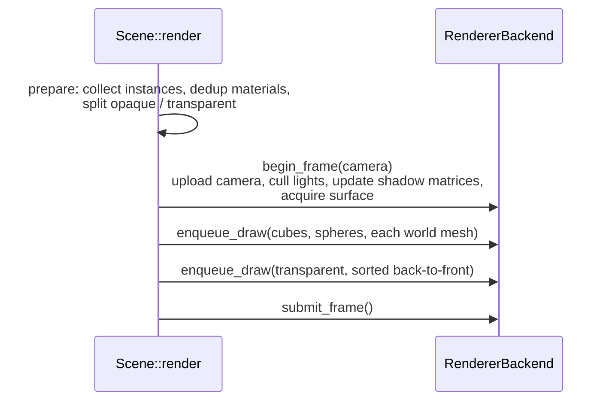
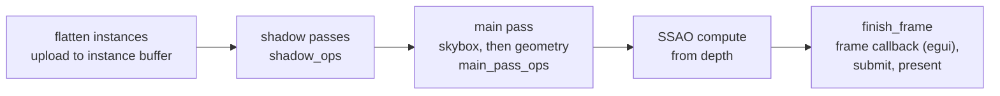

# Rendering

**Source:** `moho_render_api/src/` (`world_geometry.rs`), `moho_renderer/src/` (`scene.rs`,
`world_meshes.rs`, `renderer.rs`, `render_ops/`, `shadow.rs`, `ssao.rs`), `src/app/world_geometry.rs`,
`shaders/`.
**Decision:** [ADR-0001](../../_todo/adr/0001-render-api-boundary.md).

## Boundary

The renderer never names a game type. Game types implement `Renderable` and
`RenderMaterial` from `moho_render_api`, and the renderer only sees `InstanceGpu` and
`MaterialGpu`.

`Scene::render` is generic over the actor types, so `moho_renderer` compiles without
`moho_game`.

## World geometry

World geometry reaches the renderer as meshes ([ADR-0010](../../_todo/adr/0010-world-geometry-is-a-mesh-contract.md)),
not as voxel types. `moho_render_api::WorldMesh` is an owned indexed mesh with one
`Vec` per vertex channel (position, normal, ao, light rgb, sky exposure, surface);
`WorldMesh::new` refuses mismatched channel lengths, out-of-range indices and partial
triangles (`WorldMeshError`). A `WorldMeshId` is the game-chosen stable key.

`moho_renderer::WorldMeshes` (reached via `Scene::world_meshes_mut`) queues
`upsert(id, mesh, material_idx)` and `remove(id)`. `Scene::render` calls `flush`
first: replaced or removed meshes are unregistered from the backend, new ones are
registered, and an empty mesh counts as a remove. Opaque world meshes are drawn one
draw per mesh in id order.

The binary adapts voxel chunks in `src/app/world_geometry.rs`: `chunk_mesh_id` packs
the chunk position at 21 bits per signed axis, `chunk_world_mesh` converts a
`VoxelChunk`, and `insert_chunk` / `remove_chunk` keep the `ChunkStore`, the
renderer and the physics colliders in step. The same `WorldMesh` and `WorldMeshId` go to
`PhysicsWorld::set_world_mesh` / `remove_world_mesh` (`moho_physics/src/world.rs`), which
holds one static trimesh collider per id; an empty mesh holds none. A refused mesh is
logged and the chunk is neither drawn nor solid.

## Submission

`Scene::render` (called from the redraw handler) does CPU-side collection, then calls
the backend in a fixed sequence:

`begin_frame` returns `FrameError` if the surface can't be acquired; the frame is
skipped with a warning.

## Pass order

`submit_frame` flattens all pending draws into one instance buffer, then records one
command encoder:

The egui UI is drawn by the `FrameCallback` the UI adapter registers on the renderer,
inside `finish_frame`. Shader sources are `shaders/*.wgsl` (`common`, `vertex`,
`fragment`, `shadow`, `skybox`, `gtao`, `ssao_blur`, `pcss`, `instance`).

## Tunables

| Setting | Where | Notes |
|---|---|---|
| Shadow quality 0–4 | `graphics.shadow_quality`, `r_shadow_quality` | Off/Low/Med/High/Ultra |
| SSAO quality 0–4 | `graphics.ssao_quality`, `r_ssao_quality` | Samples 0/4/8/16/32 |
| Debug view | `r_debug_view <mode>` | `Lighting.params.y` |
| Shadow map size | `SHADOW_MAP_SIZE` = 4096 | `shadow.rs` |
| Shadow distance | `SHADOW_DISTANCE` = 1000 | `shadow.rs` |

CPU↔GPU struct layouts: [GPU ABI](../reference/gpu-abi.md).
