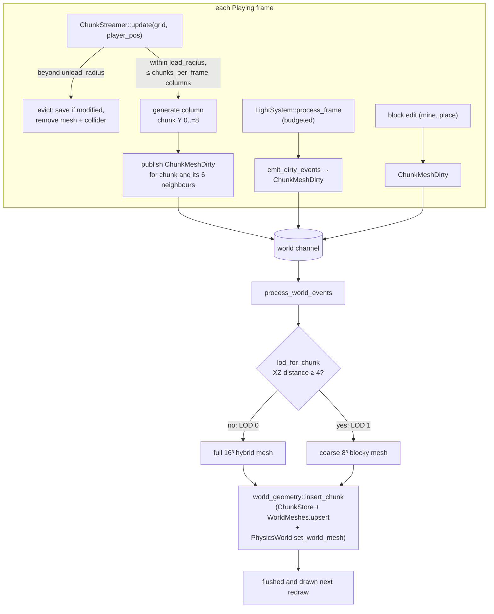

# World streaming

**Source:** `src/app/chunk_streamer.rs`, `src/app/event_loop/frame_processor.rs`
(`update_chunk_streaming`, `update_light_system`), `event_processor.rs` (`process_world_events`),
`src/app/world_geometry.rs`, `moho_core/src/voxel/` (`light_system.rs`, `streaming.rs`, `jobs.rs`, `light_jobs.rs`).
Voxels sit in `moho_core` today and move to the strategy-line `moho_voxel` per [ADR-0010](../../_todo/adr/0010-world-geometry-is-a-mesh-contract.md).

## Chunk lifecycle

Neighbours are re-meshed on load because a neighbour meshed before this chunk existed
has an exposed edge face; it must re-sample to close the seam.

## Parameters

From `[world]` in [`config/prefs.ini`](../reference/prefs-format.md):

| Key | Meaning |
|---|---|
| `load_radius` | XZ chunk radius loaded around the player |
| `unload_radius` | XZ radius beyond which chunks are evicted (keep > `load_radius` for hysteresis) |
| `chunks_per_frame` | Max new columns per frame and eviction-save budget; minimum 1 |

Chunks are 16³ voxels; columns span chunk Y 0..=8.

## Invariants

- Streaming works in whole XZ columns.
- Freshly generated, unmodified chunks are not persisted on eviction. Only player edits
  are saved ([ADR-0006](../../_todo/adr/0006-save-format-contract.md) covers the format).
- Eviction saves run synchronously in the frame, bounded by `chunks_per_frame`.
- The light system processes within a per-frame block budget, prioritised by distance to
  the player; large edits spread over several frames.

## Related

- New-world generation runs as a background job polled by `GenerationProcessor`
  (`poll_generation`); on completion it publishes `ChunkMeshDirty` for the preloaded
  area and enters `Playing`.
- Chunk meshing runs on the main thread in `process_world_events`; there is no background mesh job queue.
