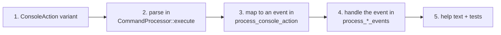

# Adding a console command

**Source:** `moho_ui/src/overlays/console/commands.rs`, `moho_ui/src/adapter/event_routing.rs`,
`src/app/event_loop/event_processor.rs`. Background: [console](../architecture/console.md).



1. **Add a variant** to `ConsoleAction` in `commands.rs`.
2. **Parse it.** Add a match arm in `CommandProcessor::execute` and a
   `<name>_command(&self, parts)` method returning a `CommandResult`. Validate arguments
   here and return a usage message on bad input; never publish from a bad parse.
3. **Publish an event.** Add an arm in `process_console_action` (`event_routing.rs`).
   Reuse an existing event family where it fits (`DebugEvent`, `GraphicsEvent`,
   `UiEvent`); a new event type goes in `moho_core::events` ([ADR-0003](../../_todo/adr/0003-core-owns-event-types.md)).
4. **Handle the event** in the matching drain in `event_processor.rs`. This is where
   `App` is mutated ([events](../architecture/events.md#the-channel-hand-off)).
5. **Document and test.** Add a line to `help_command`, a row to
   [console commands](../reference/console-commands.md), and unit tests for parsing
   (valid, missing arg, out-of-range) next to the existing ones in `commands.rs`.

## Example

```rust
// commands.rs
pub enum ConsoleAction { /* … */ Teleport(f32, f32, f32) }

"tp" => self.tp_command(&parts),
```

```rust
// event_routing.rs
ConsoleAction::Teleport(x, y, z) => {
    event_bus.publish(DebugEvent::TeleportPlayer { position: glam::Vec3::new(x, y, z) });
}
```

`DebugEvent::TeleportPlayer` already exists; add its handler in `handle_debug_event`.
