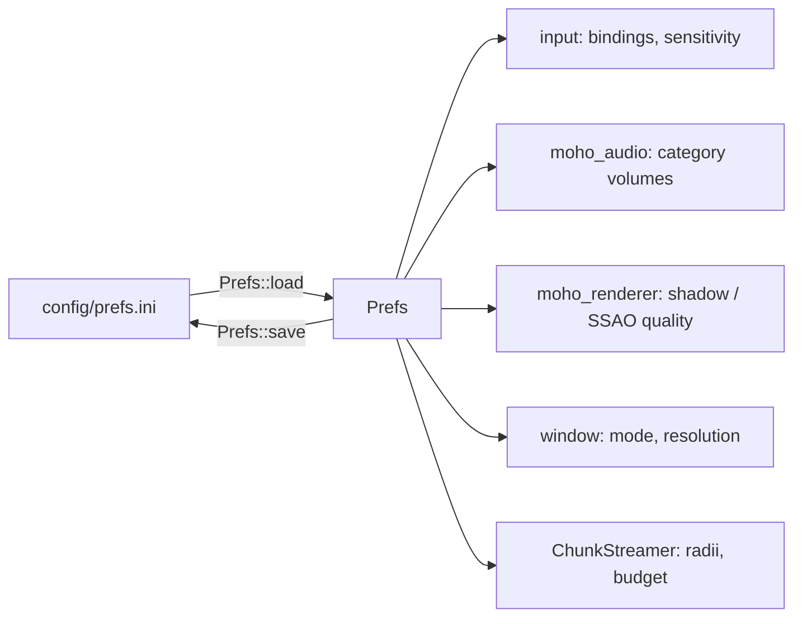

# Preferences file

**Source:** `moho_core/src/prefs/` (`mod.rs`, `parser.rs`, `key_names.rs`). Path: `config/prefs.ini`,
relative to the working directory.

`Prefs::load` creates the file with defaults if it is missing. Missing sections or keys
fall back to defaults; unknown keys are ignored. `Prefs::save` writes every key below.



## Keys

| Section | Key | Type / values | Shipped |
|---|---|---|---|
| `[prefs]` | `key_w` `key_a` `key_s` `key_d` | binding string | `W` `A` `S` `D` |
| | `key_up` `key_down` | binding string | `Spacebar` `Ctrl` |
| | `key_sprint` `key_jump` | binding string | `Shift`; `key_jump` unset in the shipped file |
| | `mouse_sensitivity` | float | `1` |
| | `input_filtering_enabled` | `true`/`1` or other = false | `true` |
| `[audio]` | `sound_effect_volume` `music_volume` `ui_volume` `voice_volume` | float, written with 1 decimal | `7.0` `5.0` `8.0` `7.0` |
| `[graphics]` | `shadow_quality` `ssao_quality` | integer 0–4, clamped | `3` `3` |
| `[video]` | `window_mode` | `Windowed` \| `Fullscreen` \| `Borderless` (unknown → `Windowed`) | `Borderless` |
| | `window_width` `window_height` | integer pixels | `1920` `1080` |
| `[world]` | `load_radius` `unload_radius` | integer chunks | `8` `12` |
| | `chunks_per_frame` | integer, minimum 1 | `4` |

Binding strings are human-readable with optional modifiers: `W`, `Ctrl+W`, `ArrowUp`.
Parsing and serialisation live in `prefs/parser.rs`.

Audio sections map to `AudioCategory` in `moho_audio/src/audio_source.rs`: `SoundEffect`,
`Music`, `UserInterface`, `Voice`.

World keys drive [world streaming](../architecture/world-streaming.md).

## Example

```ini
[prefs]
key_w=W
key_a=A
key_s=S
key_d=D
mouse_sensitivity=1.2
input_filtering_enabled=true

[audio]
music_volume=5.0

[graphics]
shadow_quality=3
ssao_quality=3

[video]
window_mode=Windowed
window_width=1280
window_height=720

[world]
load_radius=8
unload_radius=12
chunks_per_frame=4
```
