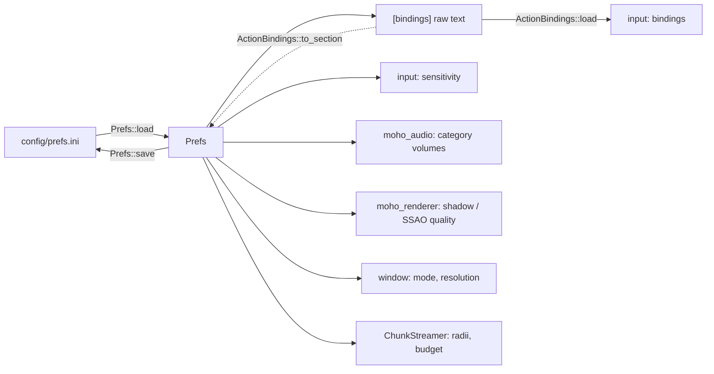

# Preferences file

**Source:** `moho_core/src/prefs/` (`mod.rs`, `reader.rs`), `moho_input/src/bindings.rs`, `moho_input/src/key.rs`, `moho_input/src/pad.rs`,
`moho_ui/src/actions.rs`. Path: `config/prefs.ini`,
relative to the working directory.

`Prefs::load` creates the file with defaults if it is missing. Missing sections or keys
take their defaults silently. `Prefs::save` writes every key below.

Anything else that can't be used is logged as a warning and falls back:

| Problem | Warning names | Falls back |
|---|---|---|
| Value that doesn't parse or isn't allowed, or a key with no `=` | file, section, key, raw value | that key |
| Unknown key | file, section, key | nothing; the other keys load |
| Unknown section | file, section | nothing; the other sections load |
| File the INI parser rejects (e.g. `[video` with no `]`) | file, parser reason (0-based line) | every key |
| File that can't be read as UTF-8 text | file, I/O reason | every key |
| Missing file that can't be created | file, I/O reason | every key |

One bad value never stops the other keys from loading. Section and key names are
case-insensitive; `;` and `#` start a comment anywhere on a line, so they can't appear
in a value. Keys before any section header are read as `[prefs]` when there is no
`[prefs]` section; when there is one, they are ignored and each is reported as an
unknown key of section `[default]`.



## Keys

| Section | Key | Accepted values | Default |
|---|---|---|---|
| `[prefs]` | `mouse_sensitivity` | finite float | `1` |
| | `input_filtering_enabled` | `true` `false` `1` `0` (any case) | `true` |
| `[bindings]` | one key per action id | binding list | per action, below |
| `[audio]` | `sound_effect_volume` `music_volume` `ui_volume` `voice_volume` | finite float, written with 1 decimal | `7.0` `5.0` `8.0` `7.0` |
| `[graphics]` | `shadow_quality` `ssao_quality` | unsigned integer; the UI offers 0 (off) to 4 (ultra) | `3` `3` |
| `[video]` | `window_mode` | `Windowed` \| `Fullscreen` \| `Borderless`, exact case | `Windowed` |
| | `window_width` `window_height` | unsigned integer pixels | `1920` `1080` |
| `[world]` | `load_radius` `unload_radius` | integer chunks | `8` `12` |
| | `chunks_per_frame` | unsigned integer, 1 or more | `4` |

`[bindings]` is stored by `Prefs` as raw text (`Prefs::bindings`, `Prefs::set_bindings`);
the game interprets it. `ActionBindings::load` (`moho_input`) reads it against the
game's `Action` enum: each key is an action's stable `name()`, each value a binding
list. Absent actions keep their defaults; `ActionBindings::to_section` writes every
action, defaults included. Line problems are returned as `BindingWarning`s and the
action keeps its default (`moho_ui::actions::load_bindings` logs them): an unknown
action id, or a value with any unrecognised key. A `[bindings]` line with no `=` is a
malformed prefs line. The pre-`[bindings]` `key_*` lines under `[prefs]` are unknown
keys and ignored.

A binding list is comma-separated key names (`W`, `Spacebar, Enter`); an action may
have several, and is active when any is held. Empty or `Unbound` (any case) is an empty list. Names are
case-insensitive and come from `Key::name` in `moho_input/src/key.rs`: letters, digits,
punctuation spelled as a word (`Comma`, `Semicolon`, `LeftBracket`, ...), `ArrowUp`..,
`Escape`, `Tab`, `Backspace`, `Enter`, `Spacebar`, and the modifiers `Shift`, `Ctrl`,
`Alt` bound on their own. `Key::parse` also accepts the aliases `Up`, `Esc`, `Return`,
`Space`, `Control` and the punctuation glyphs, but in `prefs.ini` write punctuation as
words: the INI reader cuts a line at `;` or `#`, reads a line with `[` as a section
header, and `,` separates list items. There is no modifier syntax such as `Ctrl+W`
and no numeric key codes.

Gamepad bindings are written `Pad <name>` and mix freely with keys in one list
(`jump=Spacebar, Pad South`). Buttons (`PadButton`): `South` `East` `North` `West`
`LeftBumper` `RightBumper` `LeftTrigger` `RightTrigger` `Select` `Start` `Mode`
`LeftThumb` `RightThumb` `DPadUp` `DPadDown` `DPadLeft` `DPadRight`. Stick directions
are `Pad <Stick> <Dir>` with `LeftStick` or `RightStick` and `Up` `Down` `Left` `Right`
(`Pad LeftStick Up`). A malformed pad name is an unrecognised key and warns. The right
stick's analog look is not a binding.

Strategy actions (`StrategyAction`, `moho_ui/src/actions.rs`) and defaults:

| Id | Default |
|---|---|
| `move_forward` `move_back` `move_left` `move_right` | `W` `S` `A` `D`; `Pad LeftStick` `Up` `Down` `Left` `Right` |
| `ascend` | `Spacebar`, `Pad RightTrigger` |
| `jump` | `Spacebar`, `Pad South` |
| `descend` | `Ctrl`, `Pad LeftTrigger` |
| `sprint` | `Shift`, `Pad LeftThumb` |

Action ids are persisted and never renamed.

Audio sections map to `AudioCategory` in `moho_audio/src/audio_source.rs`: `SoundEffect`,
`Music`, `UserInterface`, `Voice`.

World keys drive [world streaming](../architecture/world-streaming.md).

## Example

```ini
[prefs]
mouse_sensitivity=1.2
input_filtering_enabled=true

[bindings]
move_forward=W
jump=Spacebar, Enter
descend=Unbound

[audio]
music_volume=5.0

[graphics]
shadow_quality=3
ssao_quality=3

[video]
window_mode=Windowed
window_width=1280
window_height=720

[world]
load_radius=8
unload_radius=12
chunks_per_frame=4
```
