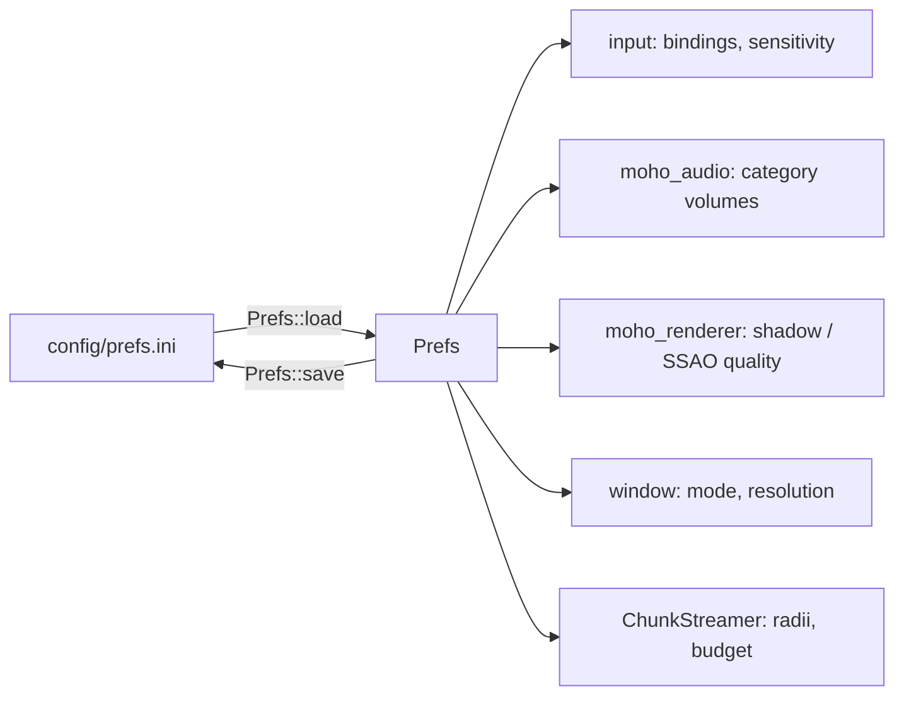

# Preferences file

**Source:** `moho_core/src/prefs/` (`mod.rs`, `reader.rs`, `parser.rs`, `key_names.rs`). Path: `config/prefs.ini`,
relative to the working directory.

`Prefs::load` creates the file with defaults if it is missing. Missing sections or keys
take their defaults silently. `Prefs::save` writes every key below.

Anything else that can't be used is logged as a warning and falls back:

| Problem | Warning names | Falls back |
|---|---|---|
| Value that doesn't parse or isn't allowed, or a key with no `=` | file, section, key, raw value | that key |
| Unknown key | file, section, key | nothing; the other keys load |
| Unknown section | file, section | nothing; the other sections load |
| File the INI parser rejects (e.g. `[video` with no `]`) | file, parser reason (0-based line) | every key |
| File that can't be read as UTF-8 text | file, I/O reason | every key |
| Missing file that can't be created | file, I/O reason | every key |

One bad value never stops the other keys from loading. Section and key names are
case-insensitive; `;` and `#` start a comment anywhere on a line, so they can't appear
in a value. Keys before any section header are read as `[prefs]` when there is no
`[prefs]` section; when there is one, they are ignored and each is reported as an
unknown key of section `[default]`.



## Keys

| Section | Key | Accepted values | Default |
|---|---|---|---|
| `[prefs]` | `key_w` `key_a` `key_s` `key_d` | binding string | `W` `A` `S` `D` |
| | `key_up` `key_down` | binding string | `Spacebar` `Ctrl` |
| | `key_sprint` `key_jump` | binding string | `Shift` `Spacebar` |
| | `mouse_sensitivity` | finite float | `1` |
| | `input_filtering_enabled` | `true` `false` `1` `0` (any case) | `true` |
| `[audio]` | `sound_effect_volume` `music_volume` `ui_volume` `voice_volume` | finite float, written with 1 decimal | `7.0` `5.0` `8.0` `7.0` |
| `[graphics]` | `shadow_quality` `ssao_quality` | unsigned integer; the UI offers 0 (off) to 4 (ultra) | `3` `3` |
| `[video]` | `window_mode` | `Windowed` \| `Fullscreen` \| `Borderless`, exact case | `Windowed` |
| | `window_width` `window_height` | unsigned integer pixels | `1920` `1080` |
| `[world]` | `load_radius` `unload_radius` | integer chunks | `8` `12` |
| | `chunks_per_frame` | unsigned integer, 1 or more | `4` |

A binding string is one key name, case-insensitive: a single character (`W`), a named
key (`ArrowUp`, `Spacebar`, `Escape`), a modifier key bound on its own (`Ctrl`, `Shift`,
`Alt`), a numeric key code of two or more digits, or `Unbound`. There is no modifier syntax such as `Ctrl+W`. Names live in
`prefs/key_names.rs`; parsing and serialisation in `prefs/parser.rs`.

Audio sections map to `AudioCategory` in `moho_audio/src/audio_source.rs`: `SoundEffect`,
`Music`, `UserInterface`, `Voice`.

World keys drive [world streaming](../architecture/world-streaming.md).

## Example

```ini
[prefs]
key_w=W
key_a=A
key_s=S
key_d=D
mouse_sensitivity=1.2
input_filtering_enabled=true

[audio]
music_volume=5.0

[graphics]
shadow_quality=3
ssao_quality=3

[video]
window_mode=Windowed
window_width=1280
window_height=720

[world]
load_radius=8
unload_radius=12
chunks_per_frame=4
```
